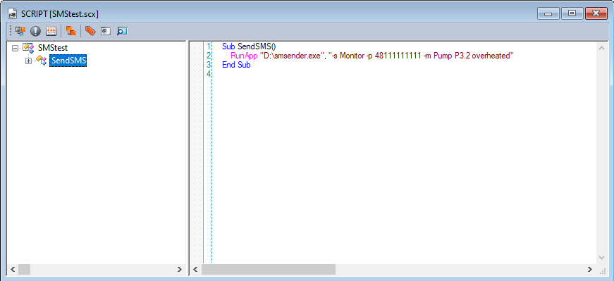
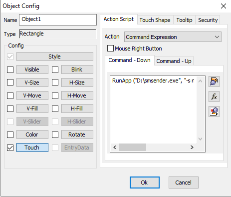

# smsender

**smsender** is a lightweight, production-ready command-line utility for sending SMS messages via **SMSAPI (smsapi.pl)**.

It is designed to be used as a standalone executable in scripts, automation workflows, monitoring systems, and industrial environments such as SCADA systems.

Repository:  
https://github.com/piotrmalek/smsender

---

## ✨ Features

- Send SMS messages directly from the command line
- Support for multiple recipients (`-p` can be used multiple times)
- Free-form SMS content (`-m`) with full support for `-` characters
- Secure API token storage using Windows DPAPI:
  - CurrentUser scope
  - LocalMachine scope
- Clear, color-coded console output
- Automatic color disabling when output is redirected
- Masking of sensitive data (API token)
- Consistent exit codes for scripting and automation
- Minimal client-side validation (final validation is handled by SMSAPI)

---

## 🛠 Requirements

- Windows (Windows DPAPI is used)
- .NET runtime (matching project configuration)
- SMSAPI account
- Active SMSAPI OAuth token

---

## 📦 Installation

1. Clone the repository:
   ```bash
   git clone https://github.com/piotrmalek/smsender.git
   ```

2. Build the project:
   ```bash
   dotnet build -c Release
   ```

3. Copy `smsender.exe` to a desired location (e.g. tools or automation directory)

---

## 🔐 API Token Configuration

### Save token for current user
```bash
smsender -t YOUR_API_TOKEN
```

### Save token for local machine (all users)
```bash
smsender -tm YOUR_API_TOKEN
```

**Notes:**
- Tokens are encrypted using Windows DPAPI
- `token.dat`:
  - cannot be decrypted on another machine
  - cannot be decrypted by another user (for CurrentUser scope)

---

## 🚀 Sending SMS

### Basic example
```bash
smsender -s Alarm -p 48111111111 -m Device failure detected
```

### Multiple recipients
```bash
smsender -s SCADA -p 48111111111 -p 48222222222 -m Critical fault - production stopped
```

### Message containing `-` characters
```bash
smsender -s Monitor -p 48111111111 -m Voltage drop -10% on phase L2
```

## 📟 Using smsender with Cimon SCADA

`smsender` integrates seamlessly with **Cimon SCADA**, allowing SMS alarm notifications to be sent directly from scripts or object actions.

### Example 1: Script-based SMS (RunApp)

```vb
Sub SendSMS()
    RunApp "D:\smsender.exe", "-s Monitor -p 48111111111 -m Pump P3.2 overheated"
End Sub
```

Typical use cases:
- alarm handling scripts
- scheduled checks
- conditional notifications



---

### Example 2: Object Action (Touch / Button)

`smsender` can also be triggered from an object action.

**Command Expression example:**

```text
RunApp("D:\smsender.exe", "-s Alarm -p 48111111111 -m Emergency stop activated")
```

Typical use cases:
- operator-triggered alarms
- service notifications
- maintenance actions



---

### Recommended Build Variant for SCADA

For SCADA and HMI environments, the **GUI (no-console) build** is recommended:

- **GUI (no-console) build**: [smsender-win-x64-gui.zip](https://github.com/piotrmalek/smsender/releases/latest/download/smsender-win-x64-gui.zip)


Advantages:
- no command-line window popup
- silent background execution
- better operator experience

The **CLI build** remains useful for:
- diagnostics
- scripting
- command-line testing

---

## 📖 Command-line Options

| Option | Description |
|------|------------|
| `-t <token>` | Save API token (CurrentUser scope) |
| `-tm <token>` | Save API token (LocalMachine scope) |
| `-s <sender>` | Sender name |
| `-p <phone>` | Recipient phone number (can be used multiple times) |
| `-m <message>` | SMS message content |
| `-h`, `-help` | Show help message |

---

## 🔁 Exit Codes

| Code | Meaning |
|----|--------|
| `0` | Success (SMS sent or token saved) |
| `1` | Runtime or API error |
| `2` | Invalid or missing parameters |

These exit codes are suitable for:
- Batch scripts
- PowerShell
- Monitoring systems
- SCADA environments

---

## 🔐 Security

- API tokens are never printed in full
- Tokens are encrypted locally using DPAPI
- No plaintext credentials stored
- No environment variables required

---

## 🧭 Typical Use Cases

- SCADA alarm and fault notifications
- Server and service monitoring
- Scheduled automation tasks
- Industrial maintenance systems
- Manual SMS sending from CLI

---

## 📜 License

This project is licensed under the **MIT License**.

Distributed as-is, without any warranty.

---

## Author

**Piotr Małek**  
GitHub: https://github.com/piotrmalek